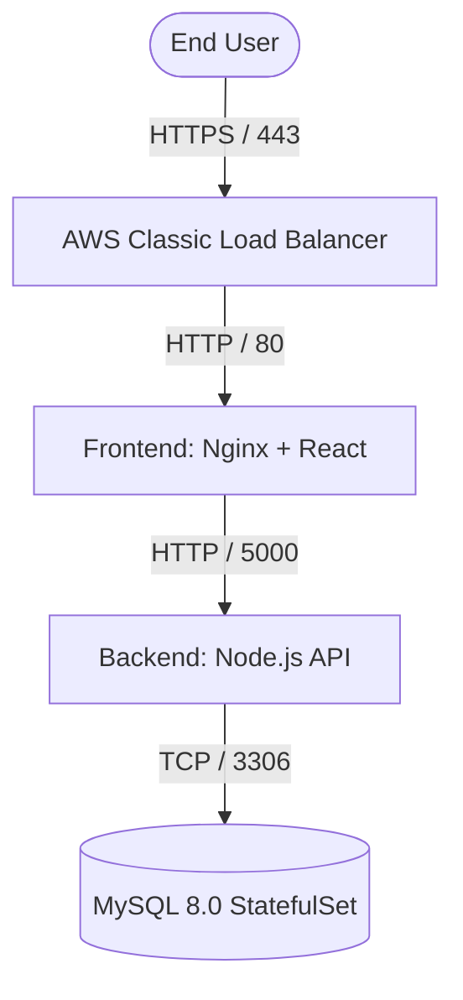

# Cloud Directory - 3-Tier EKS Architecture 🚀

[](https://kubernetes.io/)
[](https://aws.amazon.com/)
[](https://reactjs.org/)
[](https://nodejs.org/)
[](https://www.mysql.com/)

A production-grade, highly available, 3-Tier Cloud Directory application deployed on **Amazon Elastic Kubernetes Service (EKS)**. This project demonstrates advanced DevOps practices including microservice containerization, stateful database management, IAM role-based access control, Custom Domain Routing, and SSL/TLS termination at the Load Balancer level.

> **Live Demo:** [https://learning.dynv6.net](https://learning.dynv6.net)

---

## 🏗️ Architecture Overview

The architecture consists of three distinct layers deployed across a custom Amazon VPC using EKS.



### 1. Presentation Tier (Frontend)
- **Framework:** React.js (Vite)
- **Server:** Nginx (Alpine)
- **Deployment:** Handled via Kubernetes `Deployment` object. Nginx acts as both a static file server and a reverse proxy for API requests to solve CORS issues.
- **Security:** Exposed to the internet via an AWS Classic Load Balancer with an ACM SSL Certificate attached for HTTPS offloading.

### 2. Logic Tier (Backend)
- **Framework:** Node.js (Express)
- **Deployment:** Containerized Node.js API deployed as a Kubernetes `Deployment`.
- **Networking:** Exposed internally via a Kubernetes `ClusterIP` Service. It dynamically connects to the database via environment variables injected by Kubernetes.

### 3. Data Tier (Database)
- **Engine:** MySQL 8.0
- **Deployment:** Deployed as a Kubernetes `StatefulSet` to guarantee stable network identifiers (`mysql-0`).
- **Storage:** Bypasses AWS EBS restrictions by utilizing raw SSD `hostPath` persistent volumes for extremely fast local I/O.

---

## 📚 Step-by-Step Documentation

To ensure this project is fully reproducible, every single step from creating the AWS account to configuring the Custom Domain has been meticulously documented. 

Please follow these guides in order:

1. [Phase 1: AWS Account & Initial User Setup](docs/01-aws-setup.md)
2. [Phase 2: VPC & Custom Networking Configuration](docs/02-vpc-networking.md)
3. [Phase 3: IAM Roles & Policies Configuration](docs/03-iam-roles.md)
4. [Phase 4: Provisioning the Workstation (EC2)](docs/04-ec2-workstation.md)
5. [Phase 5: GitHub Integration & Code Management](docs/05-git-clone.md)
6. [Phase 6: Containerization & AWS ECR](docs/06-docker-ecr.md)
7. [Phase 7: Deploying the EKS Cluster](docs/07-eks-cluster.md)
8. [Phase 8: Applying Kubernetes Manifests](docs/08-kubernetes-deployment.md)
9. [Phase 9: SSL Offloading & Custom Domain](docs/09-ssl-and-domain.md)
10. [Phase 10: Automating CI/CD with CodePipeline](docs/10-cicd-codepipeline.md)
11. [Phase 11: Tearing Down & Cost Prevention](docs/11-cleanup-guide.md)
12. [The Interview Guide (End-to-End Flow)](docs/12-interview-guide.md)

---

## 🚀 Quick Start (Local Development)

If you wish to run the application locally using Docker:

```bash
# 1. Start the Database
docker run -d --name mysql-db -e MYSQL_ROOT_PASSWORD=rootpassword -e MYSQL_DATABASE=user_directory -p 3306:3306 mysql:8.0

# 2. Run the Backend
cd backend
npm install
node server.js

# 3. Run the Frontend
cd frontend
npm install
npm run dev
```
